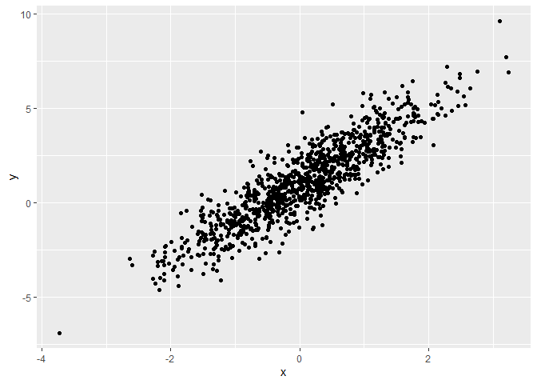
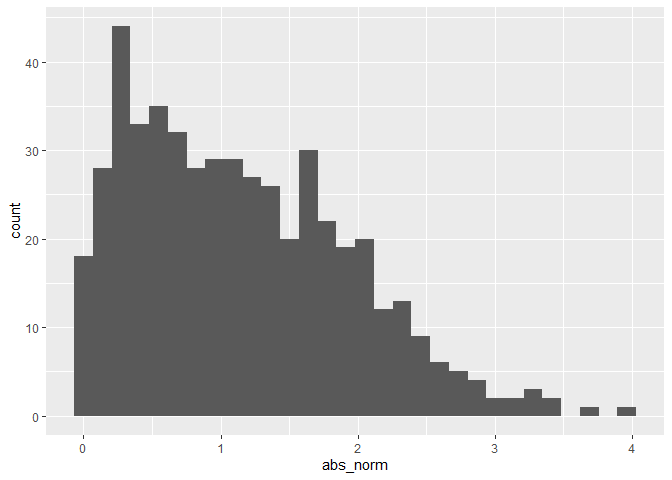

Simple document
================

I’m an R Markdown document!

# Section 1

Here’s a **code chunk** that samples from a *normal distribution*:

``` r
samp = rnorm(100)
length(samp)
```

    ## [1] 100

# Section 2

I can take the mean of the sample, too! The mean is 0.1023285.

# Sectioin3

### plot for last time

This is going to make a plot! First I generate a, then dataframe, then
use `ggplot` to mkae a scatterplot.

``` r
##write note if you want
# chunk_scatterplot=name the code chunk
#eval=false =pass the code
#message OR echo=FALSE

plot_df=
  tibble(
    x = rnorm(n = 1000),
    y = 1 + 2 * x + rnorm(n = 1000)
  )
ggplot(plot_df,aes(x=x,y=y))+geom_point()
```

<!-- -->

### Plot for learning Assessment

This is a quick kind of solution of LA

``` r
 la_df=
  tibble(
    norm = rnorm(n = 500, mean=1),
    logical= norm > 0,
    abs_norm=abs(norm)
  )

ggplot(la_df,aes(x=abs_norm))+geom_histogram()
```

    ## `stat_bin()` using `bins = 30`. Pick better value with `binwidth`.

<!-- -->

Here is a list:

-   list1
-   list2
